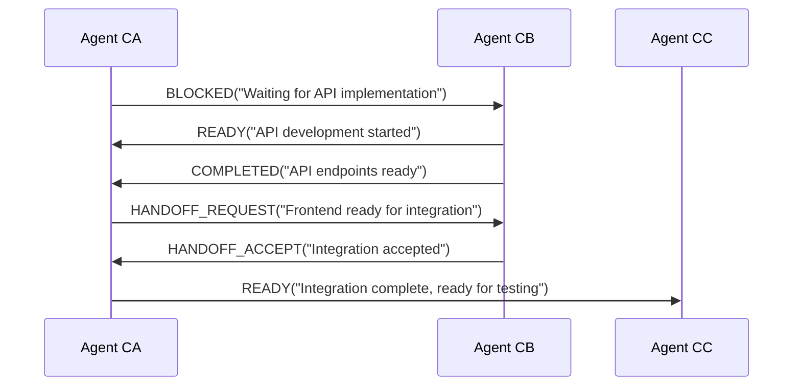
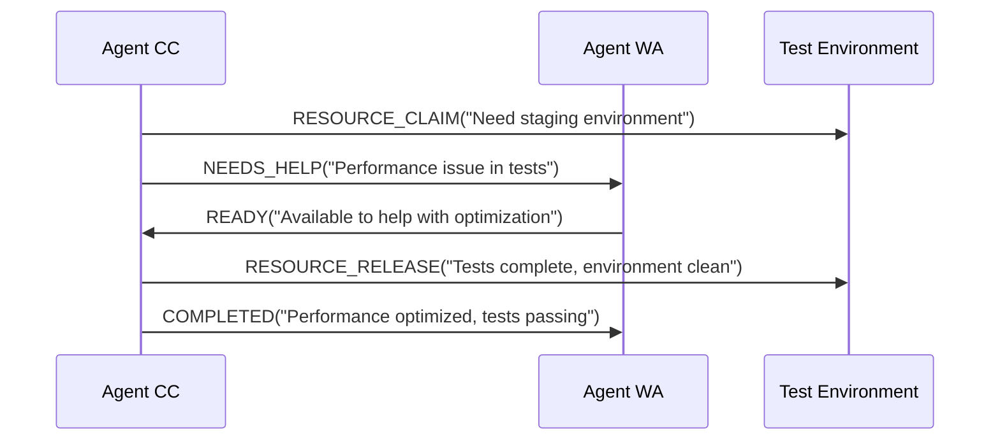
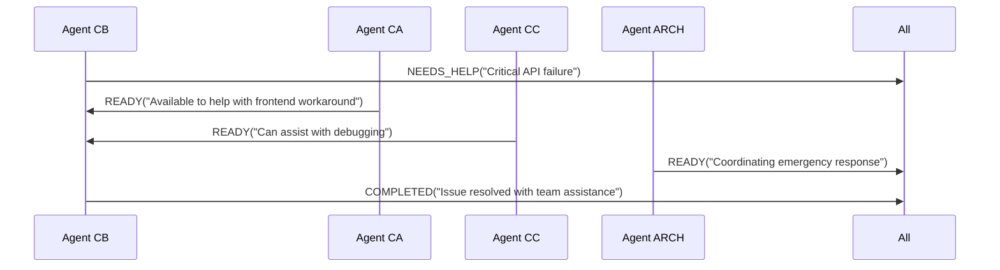

# Agent Communication Protocol
## TASK-165I Implementation

> 🤝 **Inter-agent communication system for coordinated task execution and dependency management**

## Overview

The Agent Communication Protocol (ACP) enables autonomous AI agents to coordinate work, signal dependencies, and communicate status changes in real-time. This protocol facilitates seamless task handoffs, blocks resolution, and resource sharing across the multi-agent system.

## 🎯 Protocol Objectives

### Primary Goals
- **Task Coordination**: Enable agents to signal when tasks are ready for handoff
- **Dependency Management**: Track and resolve blocking dependencies between tasks
- **Status Broadcasting**: Real-time status updates across the agent network
- **Resource Sharing**: Coordinate access to shared resources and data
- **Error Recovery**: Facilitate help requests and collaborative problem-solving

### Design Principles
- **Asynchronous**: Non-blocking communication that doesn't interrupt agent workflows
- **File-based**: Simple, reliable communication using JSON signal files
- **Self-documenting**: Signals include context and metadata for transparency
- **Atomic**: Signal operations are atomic to prevent race conditions
- **Auditable**: Complete signal history for debugging and analysis

## 🔄 Signal Types

### Core Signal Types

#### 1. READY
**Purpose**: Indicates agent is ready to receive new tasks or dependencies are resolved
```json
{
  "signal_type": "READY",
  "from_agent": "CA",
  "message": "Dashboard implementation complete, ready for integration tasks",
  "context": {
    "completed_task": "TASK-165G",
    "available_for": ["frontend", "ui", "integration"],
    "estimated_capacity": "6 hours"
  }
}
```

#### 2. BLOCKED
**Purpose**: Signals that agent is blocked waiting for dependencies or resources
```json
{
  "signal_type": "BLOCKED",
  "from_agent": "CC",
  "to_agent": "CB",
  "message": "Cannot proceed with integration tests until performance metrics API is ready",
  "context": {
    "blocked_task": "TASK-165F",
    "waiting_for": "TASK-165E",
    "urgency": "HIGH",
    "estimated_delay": "2 hours"
  }
}
```

#### 3. COMPLETED
**Purpose**: Announces task completion and any deliverables available for other agents
```json
{
  "signal_type": "COMPLETED",
  "from_agent": "CA",
  "message": "Agent status dashboard completed and accessible",
  "context": {
    "completed_task": "TASK-165G",
    "deliverables": [
      "Dashboard UI at localhost:3000",
      "API endpoints at /api/*",
      "Documentation in docs/tools/DASHBOARD_SETUP.md"
    ],
    "follow_up_available": true
  }
}
```

#### 4. NEEDS_HELP
**Purpose**: Requests assistance from other agents or escalates issues
```json
{
  "signal_type": "NEEDS_HELP",
  "from_agent": "CB",
  "message": "Encountering performance bottleneck in metrics calculation",
  "context": {
    "current_task": "TASK-165E",
    "issue_type": "performance",
    "expertise_needed": ["optimization", "database"],
    "urgency": "MEDIUM",
    "attempted_solutions": ["caching", "query optimization"]
  }
}
```

#### 5. RESOURCE_CLAIM
**Purpose**: Claims exclusive access to shared resources
```json
{
  "signal_type": "RESOURCE_CLAIM",
  "from_agent": "CC",
  "message": "Claiming test environment for integration testing",
  "context": {
    "resource": "test_environment_staging",
    "duration": "30 minutes",
    "exclusive": true,
    "reason": "End-to-end test suite execution"
  }
}
```

#### 6. RESOURCE_RELEASE
**Purpose**: Releases claimed resources for other agents
```json
{
  "signal_type": "RESOURCE_RELEASE",
  "from_agent": "CC",
  "message": "Test environment released, all tests passed",
  "context": {
    "resource": "test_environment_staging",
    "results": "success",
    "notes": "Environment clean, ready for next use"
  }
}
```

### Extended Signal Types

#### 7. HANDOFF_REQUEST
**Purpose**: Formally requests task handoff to another agent
```json
{
  "signal_type": "HANDOFF_REQUEST",
  "from_agent": "CA",
  "to_agent": "CB",
  "message": "Frontend component ready for backend integration",
  "context": {
    "task_id": "TASK-165J",
    "handoff_artifacts": ["UI components", "API specifications"],
    "acceptance_criteria": ["API integration", "data flow validation"],
    "deadline": "2025-05-29T18:00:00Z"
  }
}
```

#### 8. HANDOFF_ACCEPT
**Purpose**: Confirms acceptance of task handoff
```json
{
  "signal_type": "HANDOFF_ACCEPT",
  "from_agent": "CB",
  "to_agent": "CA",
  "message": "Backend integration accepted, starting implementation",
  "context": {
    "task_id": "TASK-165J",
    "estimated_completion": "2025-05-29T16:00:00Z",
    "questions": ["API rate limiting requirements?"]
  }
}
```

## 📁 Signal File Format

### File Structure
```
.signals/
├── YYYYMMDD/              # Daily signal directories
│   ├── {timestamp}_{from}_{to}_{type}.json
│   └── signal_index.json  # Daily signal index
├── active/                # Active signals requiring response
│   └── {signal_id}.json
├── archive/               # Archived completed signals
│   └── YYYYMM/
└── signal_log.json        # Master signal log
```

### Signal File Schema
```json
{
  "$schema": "https://json-schema.org/draft/2019-09/schema",
  "type": "object",
  "required": ["signal_id", "signal_type", "timestamp", "from_agent"],
  "properties": {
    "signal_id": {
      "type": "string",
      "description": "Unique signal identifier",
      "pattern": "^SIG-[0-9]{8}-[A-Z0-9]{6}$"
    },
    "signal_type": {
      "type": "string",
      "enum": ["READY", "BLOCKED", "COMPLETED", "NEEDS_HELP", "RESOURCE_CLAIM", "RESOURCE_RELEASE", "HANDOFF_REQUEST", "HANDOFF_ACCEPT"]
    },
    "timestamp": {
      "type": "string",
      "format": "date-time",
      "description": "ISO 8601 timestamp when signal was created"
    },
    "from_agent": {
      "type": "string",
      "description": "Agent ID sending the signal"
    },
    "to_agent": {
      "type": "string",
      "description": "Target agent ID (optional for broadcast signals)"
    },
    "message": {
      "type": "string",
      "description": "Human-readable signal message"
    },
    "context": {
      "type": "object",
      "description": "Signal-specific context and metadata"
    },
    "priority": {
      "type": "string",
      "enum": ["LOW", "MEDIUM", "HIGH", "CRITICAL"],
      "default": "MEDIUM"
    },
    "expires_at": {
      "type": "string",
      "format": "date-time",
      "description": "Optional expiration timestamp"
    },
    "response_required": {
      "type": "boolean",
      "default": false,
      "description": "Whether this signal requires a response"
    },
    "related_signals": {
      "type": "array",
      "items": {"type": "string"},
      "description": "Array of related signal IDs"
    }
  }
}
```

### Signal ID Format
- Pattern: `SIG-YYYYMMDD-HHMMSS-XXX`
- Example: `SIG-20250529-143022-A7F`
- Components:
  - `SIG-`: Fixed prefix
  - `YYYYMMDD`: Date of signal creation
  - `HHMMSS`: Time of signal creation
  - `XXX`: Random 3-character suffix

## 🔧 Signal Management Tools

### Core Tools

#### 1. send_signal.py
**Purpose**: Create and send signals between agents
```bash
# Send a ready signal
python3 tools/send_signal.py --type READY --message "Ready for new tasks"

# Send a blocked signal to specific agent
python3 tools/send_signal.py --type BLOCKED --to CB --message "Waiting for API" \
  --context '{"blocked_task": "TASK-165F", "waiting_for": "TASK-165E"}'

# Send completion with deliverables
python3 tools/send_signal.py --type COMPLETED --message "Dashboard complete" \
  --context '{"task_id": "TASK-165G", "deliverables": ["Dashboard UI", "API endpoints"]}'
```

#### 2. check_signals.py
**Purpose**: Monitor and query signals
```bash
# Check all signals for current agent
python3 tools/check_signals.py

# Check signals from specific agent
python3 tools/check_signals.py --from CA

# Check active signals requiring response
python3 tools/check_signals.py --active

# Monitor signals in real-time
python3 tools/check_signals.py --monitor
```

### Advanced Tools

#### 3. signal_dashboard.py
**Purpose**: Web-based signal monitoring dashboard
```bash
# Launch signal monitoring dashboard
python3 tools/signal_dashboard.py --port 3001
```

#### 4. signal_analyzer.py
**Purpose**: Analyze signal patterns and performance
```bash
# Generate signal analysis report
python3 tools/signal_analyzer.py --report

# Analyze communication patterns
python3 tools/signal_analyzer.py --patterns --days 7
```

## 🚀 Communication Workflows

### Workflow 1: Task Dependency Resolution



### Workflow 2: Resource Coordination



### Workflow 3: Emergency Escalation



## 🔌 Integration Points

### Task Completion Integration
The communication protocol integrates seamlessly with existing task management:

```bash
# Enhanced task completion with automatic signaling
tools/complete_task.sh CA TASK-165G --signal-completion \
  --message "Dashboard complete" \
  --deliverables "Dashboard UI,API endpoints,Documentation"
```

### Morning Kickoff Integration
Morning kickoff automation includes signal checking:

```bash
# Morning kickoff checks for overnight signals
tools/morning_kickoff.sh --check-signals --resolve-blocks
```

### Dashboard Integration
The agent status dashboard displays communication activity:
- Active signals count
- Recent communication timeline
- Blocked agents requiring attention
- Signal response times

## 📊 Signal Monitoring

### Key Metrics
- **Signal Response Time**: Average time between signal and response
- **Block Resolution Time**: Time to resolve blocking dependencies
- **Communication Frequency**: Signals per hour/day by agent
- **Signal Success Rate**: Percentage of signals leading to resolution
- **Help Request Resolution**: Time to resolve NEEDS_HELP signals

### Monitoring Dashboard
Access signal monitoring at: http://localhost:3001/signals

**Features:**
- Real-time signal feed
- Agent communication heatmap
- Blocking dependency visualization
- Signal response time analytics
- Communication pattern analysis

## 🔒 Security and Privacy

### Signal Security
- **Access Control**: Signals are readable by all agents but writable only by sender
- **Input Validation**: All signal content is validated against schema
- **Audit Trail**: Complete signal history with timestamps and integrity checks
- **Rate Limiting**: Prevent signal spam with configurable rate limits

### Privacy Considerations
- **Context Filtering**: Sensitive data should not be included in signal context
- **Message Sanitization**: Automatic sanitization of sensitive information
- **Retention Policy**: Signals archived after 30 days, purged after 1 year

## 🐛 Debugging and Troubleshooting

### Common Issues

#### 1. Signal Not Received
```bash
# Check signal file exists
ls -la .signals/$(date +%Y%m%d)/

# Validate signal format
python3 tools/signal_validator.py SIG-20250529-143022-A7F

# Check agent signal processing
tail -f .signals/signal_log.json
```

#### 2. Response Timeout
```bash
# Check active signals requiring response
python3 tools/check_signals.py --active --timeout

# Send reminder signal
python3 tools/send_signal.py --type REMINDER --reference SIG-20250529-143022-A7F
```

#### 3. Signal Processing Errors
```bash
# Check signal processing logs
tail -f logs/signal_processing.log

# Validate all signals for corruption
python3 tools/signal_validator.py --scan --fix
```

### Debug Mode
Enable debug mode for detailed signal tracing:
```bash
export AGENT_SIGNAL_DEBUG=1
python3 tools/check_signals.py --verbose
```

## 📈 Performance Optimization

### Signal Processing Performance
- **Batch Processing**: Process signals in batches for efficiency
- **Indexing**: Maintain signal indexes for fast querying
- **Compression**: Compress archived signals to save space
- **Caching**: Cache frequently accessed signals in memory

### Network Optimization
- **Signal Deduplication**: Prevent duplicate signals
- **Priority Queuing**: Process high-priority signals first
- **Async Processing**: Non-blocking signal processing
- **Bulk Operations**: Batch multiple signals when possible

## 🚀 Future Enhancements

### Planned Features
- **WebSocket Integration**: Real-time signal push notifications
- **Signal Templates**: Pre-defined signal templates for common scenarios
- **Machine Learning**: Predictive blocking detection and auto-resolution
- **External Integration**: Slack/Teams notifications for critical signals
- **Signal Routing**: Intelligent signal routing based on agent expertise
- **Distributed Signals**: Multi-node signal distribution for scalability

### API Extensions
- **REST API**: HTTP endpoints for external signal integration
- **GraphQL**: Advanced signal querying capabilities
- **Webhooks**: External system integration for signal events
- **Signal Subscriptions**: Real-time signal subscriptions for external tools

## 📚 Examples and Use Cases

### Example 1: Frontend-Backend Handoff
```json
{
  "signal_type": "HANDOFF_REQUEST",
  "from_agent": "CA",
  "to_agent": "CB",
  "message": "Login component ready for backend integration",
  "context": {
    "task_id": "TASK-LOGIN-UI",
    "components": ["LoginForm.tsx", "AuthContext.tsx"],
    "api_requirements": {
      "endpoints": ["/api/auth/login", "/api/auth/logout"],
      "authentication": "JWT",
      "validation": "zod schema included"
    },
    "testing": "Unit tests passing, ready for integration"
  },
  "priority": "HIGH",
  "response_required": true
}
```

### Example 2: Resource Conflict Resolution
```json
{
  "signal_type": "RESOURCE_CLAIM",
  "from_agent": "CC",
  "message": "Need exclusive access to database for migration",
  "context": {
    "resource": "production_database",
    "operation": "schema_migration",
    "estimated_duration": "15 minutes",
    "backup_required": true,
    "rollback_plan": "automated rollback script ready"
  },
  "priority": "CRITICAL",
  "expires_at": "2025-05-29T16:00:00Z"
}
```

### Example 3: Emergency Assistance
```json
{
  "signal_type": "NEEDS_HELP",
  "from_agent": "WA",
  "message": "Deployment pipeline failing on production",
  "context": {
    "issue": "kubernetes_deployment_timeout",
    "error_code": "E503",
    "urgency": "CRITICAL",
    "impact": "production_down",
    "attempted_fixes": ["restart", "rollback", "scaling"],
    "logs": "s3://logs/deployment/2025-05-29-error.log",
    "expertise_needed": ["kubernetes", "networking", "debugging"]
  },
  "priority": "CRITICAL",
  "response_required": true
}
```

## 📋 Quick Reference

### Signal Types Summary
| Type | Purpose | Response Required | Priority |
|------|---------|------------------|----------|
| READY | Agent available for work | No | MEDIUM |
| BLOCKED | Waiting for dependencies | No | HIGH |
| COMPLETED | Task finished | No | LOW |
| NEEDS_HELP | Requesting assistance | Yes | HIGH |
| RESOURCE_CLAIM | Claiming shared resource | No | MEDIUM |
| RESOURCE_RELEASE | Releasing shared resource | No | LOW |
| HANDOFF_REQUEST | Requesting task handoff | Yes | HIGH |
| HANDOFF_ACCEPT | Accepting task handoff | No | MEDIUM |

### Command Quick Reference
```bash
# Send signals
python3 tools/send_signal.py --type READY --message "Available for work"
python3 tools/send_signal.py --type BLOCKED --to CB --message "Need API"
python3 tools/send_signal.py --type COMPLETED --message "Task done"

# Check signals
python3 tools/check_signals.py                    # All signals for me
python3 tools/check_signals.py --from CA          # From specific agent
python3 tools/check_signals.py --active           # Active signals only
python3 tools/check_signals.py --monitor          # Real-time monitoring

# Signal management
python3 tools/signal_validator.py --scan          # Validate all signals
python3 tools/signal_analyzer.py --report         # Generate report
python3 tools/signal_dashboard.py --port 3001     # Launch dashboard
```

---

**Implementation Date**: May 29, 2025  
**Version**: 1.0.0  
**TASK ID**: TASK-165I  
**Status**: 🚧 IN PROGRESS  

*🎯 Communication protocol documented and ready for implementation* 