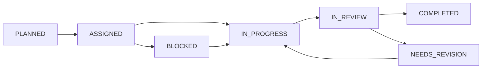

# ARCH-Claude Task Orchestration Protocol

## Overview
This document defines how ARCH-Claude orchestrates CC and CA agents during Sprint 4 Integration Sprint.

## Task Assignment Format

### Task Card Structure
```yaml
task_id: SPRINT4-001
assigned_to: CC
priority: HIGH
blocked_by: []
blocks: [SPRINT4-002]

title: Create UnifiedWorkflowEngine Adapter
description: |
  Bridge WorkflowEngine and StatefulDAGRunner to unify architecture
  
acceptance_criteria:
  - Adapter implements common interface
  - All existing workflows continue to work
  - New workflows can use StatefulDAGRunner features
  - Performance overhead <100ms
  
technical_notes:
  - Use adapter pattern to wrap both engines
  - Preserve backward compatibility
  - Add feature flags for gradual migration
  
estimated_hours: 16
due_date: 2025-06-02
```

## Communication Channels

### 1. Task Assignment (ARCH → Agents)
```
/postbox/CC/inbox.md  
/postbox/CA/inbox.md
```

### 2. Progress Reports (Agents → ARCH)
```
/postbox/ARCH/inbox.md
```

### 3. Blocker Escalation
```
/postbox/ARCH/URGENT.md
```

### 4. Code Review Requests
Via PR comments with @ARCH-Claude mention

## Daily Orchestration Workflow

### Morning (9 AM)
1. ARCH reviews overnight progress in agent outboxes
2. Updates sprint daily log
3. Assigns new tasks based on completion
4. Addresses blockers

### Midday (1 PM)  
1. Quick sync via postbox
2. Adjust priorities if needed
3. Unblock dependencies

### Evening (5 PM)
1. Progress assessment
2. Next day planning
3. Documentation updates

## Task States



## Orchestration Commands

### Task Assignment
```markdown
@CC: Please begin SPRINT4-001. Priority: HIGH. Due: June 2.
See task details in `/tasks/SPRINT4-001.yaml`
```

### Status Check
```markdown
@CC: Status update requested for SPRINT4-001.
Please include: % complete, blockers, ETA
```

### Blocker Resolution
```markdown
@CC: Acknowledged blocker on SPRINT4-001.
Resolution: [specific solution]
Please proceed with [next steps]
```

### Code Review
```markdown
@CC: Reviewing PR #123.
Feedback:
- Architecture: ✅ Approved
- Performance: ⚠️ See comments  
- Tests: ✅ Comprehensive
Action: Address performance concerns then merge
```

## Parallel Coordination

### When CC and CA need to coordinate:
1. ARCH creates interface specification
2. Both agents develop against spec
3. ARCH oversees integration testing

### Example:
```yaml
interface: DAG Run API
cc_task: Implement backend endpoints
ca_task: Implement frontend client
coordination_point: API contract in /docs/api/dag-runs.yaml
integration_test: /tests/integration/test_dag_api.py
```

## Quality Gates

### Before Task Completion:
- [ ] Code compiles without warnings
- [ ] All tests pass
- [ ] Documentation updated
- [ ] Performance benchmarks met
- [ ] Security review (if applicable)

### Before Sprint Completion:
- [ ] All tasks completed
- [ ] Integration tests passing
- [ ] Performance benchmarks met
- [ ] Documentation complete
- [ ] Demo ready

## Escalation Path

1. **Technical Blockers**: ARCH provides solution within 2 hours
2. **Dependency Delays**: ARCH re-prioritizes tasks
3. **Scope Questions**: ARCH makes decision, documents in ADR
4. **Quality Issues**: ARCH provides specific feedback for revision

## Documentation Requirements

### Per Task:
- Code comments
- API documentation
- Test documentation
- README updates if needed

### Per Week:
- Architecture Decision Records
- Sprint progress report
- Updated task board

### Per Sprint:
- Comprehensive documentation
- Lessons learned
- Performance report
- Demo video/script

---

This protocol ensures efficient orchestration while maintaining quality and momentum throughout Sprint 4.