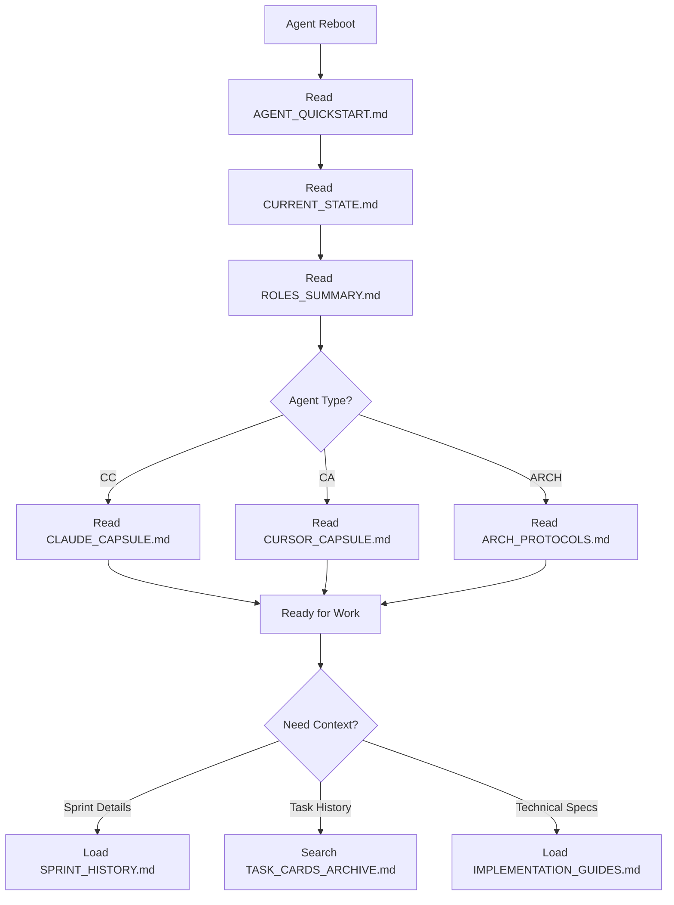

# Context File Optimization Plan 🧹

**Version**: 1.0.0  
**Created**: 2025-05-27  
**Author**: CC (Claude Code)  
**Status**: DRAFT

## Executive Summary

This plan proposes a streamlined context management system to reduce agent onboarding time from ~100KB to ~15KB of essential information, with additional context loaded on-demand.

## Current State Analysis

### File Inventory & Metrics

| File | Size | Lines | Purpose | Load Priority |
|------|------|-------|---------|---------------|
| TASK_CARDS.md | 48KB | ~1400 | Active/completed tasks | 📦 Archival |
| CLAUDE_CONTEXT.md | 18KB | ~500 | CC agent history | 🧠 Essential (agent-specific) |
| ROLES_AND_RESPONSIBILITIES.md | 11KB | ~400 | Agent boundaries | 🧠 Essential |
| ARCH_CONTINUITY.md | 10KB | ~320 | ARCH-AI protocol | 🧠 Essential (ARCH only) |
| CURSOR_CONTEXT.md | 6.4KB | ~200 | CA agent context | 🧠 Essential (agent-specific) |
| SPRINT_HISTORY.md | 3KB | ~100 | Sprint summaries | 📜 Reference |
| AGENT_ROSTER.md | 1.9KB | ~60 | Current agents | 🧠 Essential |

**Total Context Load**: ~98.3KB (excessive for quick reboots)

### Identified Issues

1. **Redundancy**: Multiple files contain overlapping agent role definitions
2. **Historical Bloat**: Agent context files contain entire phase histories
3. **Task Overload**: TASK_CARDS.md includes 1400+ lines of completed tasks
4. **Unclear Hierarchy**: No clear distinction between essential vs reference docs
5. **Missing Summaries**: No quick-reference capsules for deep context

## Proposed Architecture

### 1. Three-Tier Context System

```
┌─────────────────────────────────────────────────┐
│         🧠 TIER 1: ESSENTIAL (Load Always)      │
│                    ~15KB Total                   │
├─────────────────────────────────────────────────┤
│ • AGENT_QUICKSTART.md (new) - 2KB              │
│ • CURRENT_STATE.md (new) - 3KB                 │
│ • Agent-specific context - 5KB                  │
│ • ROLES_SUMMARY.md (new) - 5KB                 │
└─────────────────────────────────────────────────┘
                         ↓
┌─────────────────────────────────────────────────┐
│      📜 TIER 2: REFERENCE (Load on Demand)      │
│                    ~30KB Total                   │
├─────────────────────────────────────────────────┤
│ • SPRINT_HISTORY.md                             │
│ • ARCH_CONTINUITY.md (protocols only)          │
│ • Recent task summaries                         │
└─────────────────────────────────────────────────┘
                         ↓
┌─────────────────────────────────────────────────┐
│      📦 TIER 3: ARCHIVAL (Search Only)          │
│                    ~50KB+ Total                  │
├─────────────────────────────────────────────────┤
│ • TASK_CARDS.md (full history)                  │
│ • Phase-specific documentation                   │
│ • Legacy reports and audits                      │
└─────────────────────────────────────────────────┘
```

### 2. New File Structure

#### A. Essential Files (Tier 1)

**AGENT_QUICKSTART.md** (NEW - 2KB max)
```markdown
# Agent Quick Start Guide

## Your Identity
[Agent-specific: CC/CA/ARCH]

## Current Sprint
[Active sprint, phase, key objectives]

## Your Top 5 Responsibilities
[Bullet list specific to agent]

## Critical Boundaries
[What you must NOT do]

## Next Steps
[Immediate priorities]
```

**CURRENT_STATE.md** (NEW - 3KB max)
```markdown
# System Current State

## Phase & Sprint
[One paragraph summary]

## Recent Completions
[Last 5 major milestones]

## Active Work
[Current tasks in progress]

## Known Issues
[Critical blockers or concerns]

## Repository State
[Branch, tag, merge status]
```

**ROLES_SUMMARY.md** (NEW - 5KB max, replaces full ROLES doc)
```markdown
# Agent Role Matrix

| Agent | Primary | Secondary | Forbidden |
|-------|---------|-----------|-----------|
| CC | Backend, Audit | Testing | UI Creation |
| CA | CLI, Frontend | Docs | Core Architecture |
| ARCH | Planning | Review | Implementation |

[Plus 1-paragraph description per agent]
```

#### B. Reference Files (Tier 2)

- **SPRINT_HISTORY.md** - Keep as-is but load only when reviewing past work
- **IMPLEMENTATION_GUIDES.md** - Merge technical how-tos from various sources
- **RECENT_TASKS.md** - Last 10 completed tasks with outcomes

#### C. Archival Files (Tier 3)

- **TASK_CARDS_ARCHIVE.md** - Move completed tasks older than current sprint
- **PHASE_*/*** - All phase-specific documentation
- **LEGACY_REPORTS.md** - Historical audits and postmortems

### 3. Onboarding Protocol v2.0



### 4. Implementation Task List (Sprint 3)

1. **TASK-163B**: Create Essential Context Files
   - Write AGENT_QUICKSTART.md template
   - Generate CURRENT_STATE.md from existing docs
   - Condense ROLES_SUMMARY.md from full doc
   - Time: 2 hours

2. **TASK-163C**: Create Agent Capsule Files  
   - Extract last 30 days from CLAUDE_CONTEXT.md → CLAUDE_CAPSULE.md
   - Extract last 30 days from CURSOR_CONTEXT.md → CURSOR_CAPSULE.md
   - Create ARCH_PROTOCOLS.md from ARCH_CONTINUITY.md
   - Time: 3 hours

3. **TASK-163D**: Archive Historical Content
   - Move completed tasks to TASK_CARDS_ARCHIVE.md
   - Keep only active sprint in TASK_CARDS.md
   - Create search index for archives
   - Time: 2 hours

4. **TASK-163E**: Update Agent Rebooting Process
   - Modify all agent context files to reference new structure
   - Update ARCH_CONTINUITY.md reboot section
   - Create migration checklist
   - Time: 1 hour

5. **TASK-163F**: Implement Auto-Summary System
   - Script to generate CURRENT_STATE.md from git/task data
   - Weekly capsule generation for agent contexts
   - Time: 3 hours

### 5. Success Metrics

| Metric | Current | Target | Improvement |
|--------|---------|--------|-------------|
| Total onboarding size | 98KB | 15KB | 85% reduction |
| Files to read | 6-7 | 3-4 | 50% reduction |
| Time to context | ~10 min | ~2 min | 80% reduction |
| Redundant content | High | None | 100% elimination |

### 6. Migration Plan

**Phase 1** (Week 1): Create new essential files without removing old ones  
**Phase 2** (Week 2): Update agent reboot protocols to use new files  
**Phase 3** (Week 3): Archive historical content and update references  
**Phase 4** (Week 4): Remove deprecated files and finalize structure

### 7. Maintenance Protocol

**Daily**: Auto-update CURRENT_STATE.md via git hooks  
**Weekly**: Regenerate agent capsule files  
**Sprint End**: Archive completed tasks, update summaries  
**Monthly**: Review and optimize file sizes

## Benefits

1. **Faster Onboarding**: 2-minute agent reboots vs 10+ minutes
2. **Clearer Boundaries**: No more hunting through multiple files
3. **Better Focus**: Only essential context loaded by default
4. **Easier Maintenance**: Clear archival and update protocols
5. **Scalability**: System remains fast as project grows

## Risks & Mitigation

| Risk | Impact | Mitigation |
|------|--------|------------|
| Lost context | Medium | Keep archives searchable |
| Update overhead | Low | Automate with scripts |
| Agent confusion | Low | Clear migration guide |

## Conclusion

This optimization will transform agent onboarding from a heavyweight process to a lightweight, focused experience while maintaining full historical context accessibility when needed.

## Appendix: File Size Comparison

### Before (98KB)
```
TASK_CARDS.md         ████████████████████████ 48KB
CLAUDE_CONTEXT.md     █████████ 18KB  
ROLES_AND_RESP.md     █████ 11KB
ARCH_CONTINUITY.md    █████ 10KB
CURSOR_CONTEXT.md     ███ 6.4KB
SPRINT_HISTORY.md     ██ 3KB
AGENT_ROSTER.md       █ 1.9KB
```

### After (15KB Essential)
```
Agent-specific        ███ 5KB
ROLES_SUMMARY.md      ███ 5KB
CURRENT_STATE.md      ██ 3KB
AGENT_QUICKSTART.md   █ 2KB
[Remaining 83KB in Reference/Archive tiers]
```